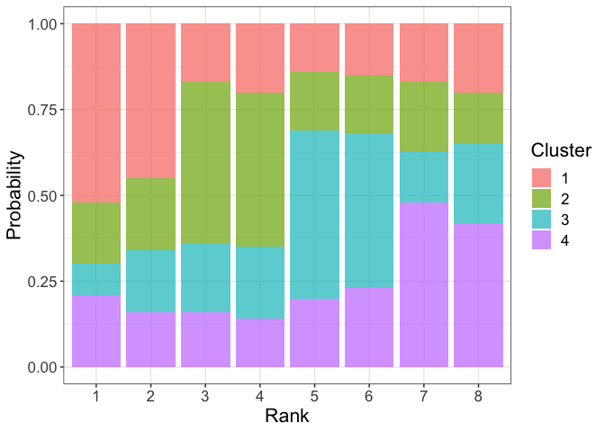
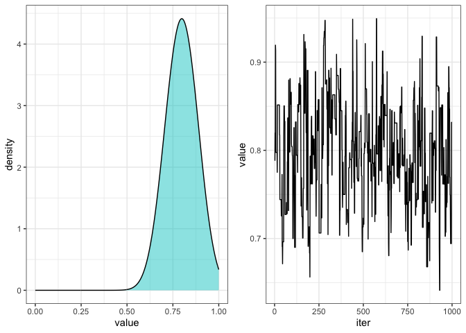

Clustered Mallows Model
================
Luiza Piancastelli

Configuration: please ensure that you have a C++ compiler properly set
up.

``` r
# Package names
packages <- c("dplyr", "reshape2", "Rcpp", "ggplot2", "gridExtra")

# Install packages not yet installed
installed_packages <- packages %in% rownames(installed.packages())
if (any(installed_packages == FALSE)) {
  install.packages(packages[!installed_packages])
}

# Packages loading
invisible(lapply(packages, library, character.only = TRUE))


sourceCpp("cmm_cpp.cpp")
source("cmm_functions.R")
```

## Simulating CMM data

``` r
z = sort(rep(1:4, 2))
theta = 0.8

Pi = rcmm(100, theta, z, 'h')

head(Pi)
```

    ##      [,1] [,2] [,3] [,4] [,5] [,6] [,7] [,8]
    ## [1,]    3    7    1    2    5    4    6    8
    ## [2,]    3    2    1    4    6    5    8    7
    ## [3,]    2    3    6    8    5    1    7    4
    ## [4,]    4    8    1    2    5    6    3    7
    ## [5,]    6    4    1    7    5    3    2    8
    ## [6,]    2    7    3    6    5    4    8    1

``` r
dim(Pi)
```

    ## [1] 100   8

``` r
apply(Pi, 2, function(x){prop.table(table(x))})
```

    ##   [,1] [,2] [,3] [,4] [,5] [,6] [,7] [,8]
    ## 1 0.19 0.20 0.15 0.12 0.05 0.08 0.09 0.12
    ## 2 0.33 0.25 0.02 0.08 0.09 0.07 0.08 0.08
    ## 3 0.08 0.12 0.25 0.22 0.12 0.06 0.08 0.07
    ## 4 0.10 0.09 0.22 0.23 0.05 0.11 0.12 0.08
    ## 5 0.03 0.09 0.10 0.09 0.31 0.19 0.09 0.10
    ## 6 0.06 0.09 0.10 0.12 0.18 0.26 0.06 0.13
    ## 7 0.09 0.06 0.10 0.05 0.15 0.15 0.19 0.21
    ## 8 0.12 0.10 0.06 0.09 0.05 0.08 0.29 0.21

## Maximum likelihood estimation

``` r
anneal = seq(0.01, 2, 0.01) #Annealing sequence for z optimization
eps = 10^(-2)               #Tolerance of algorithm

CT = rep(2, 4) #Clustering Table (CT)
CT
```

    ## [1] 2 2 2 2

``` r
mle = MLE_fit_cmm(CT, Pi, anneal, eps, dist = 'h')

mle$z_mle
```

    ## [1] 1 1 2 2 3 3 4 4

``` r
mle$theta_mle
```

    ## [1] 0.81329

Graphical summary of the fitted partition:

``` r
plot_rank_probs(Pi, mle$z_mle)
```

<!-- -->

Let us fit the simulated data with the mispecified distance and
investigate model choice.

``` r
mle2 = MLE_fit_cmm(CT, Pi, anneal, eps, dist = 'k')

I_criterion(mle, 10000)
```

    ## [1] -989.7174

``` r
I_criterion(mle2, 10000)
```

    ## [1] -1028.862

## Bayesian inference with AEA

``` r
mcmc = cmm_MCMC(CT, Pi, 1000, "h", prior_theta= list(shape = 2, rate = 2))
```

    ## [1] 100
    ## [1] 200
    ## [1] 300
    ## [1] 400
    ## [1] 500
    ## [1] 600
    ## [1] 700
    ## [1] 800
    ## [1] 900
    ## [1] 1000

``` r
mcmc$accepted_theta
```

    ## [1] 0.389

``` r
theta_chain = data.frame("iter" = 1:1000, "value" = mcmc$theta)
density = ggplot(theta_chain, aes(x = value))+geom_density(adjust =5, fill = 'cyan3', alpha = 0.5)+xlim(0,1)+theme_bw()
trace  = ggplot(theta_chain, aes(y = value, x = iter))+geom_line()+theme_bw()

grid.arrange(density, trace, ncol =2)
```

<!-- -->
